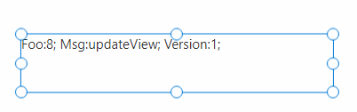

# PCFCanvasLibrarySample
Sample(s) for PCFCanvasLibrary https://github.com/FlorianGrimm/PCFCanvasLibrary

## HotReload - PCFHotReloadSample

Enables hot reload in Power Apps Studio.

Harness is used for delivering the bundle.js.

Works for the typescript - changes. Not for ControlManifest.Input.xml; Not for CSS.

Works on your machine only - no body else will "see" the new code.

### Steps

For the first steps see also Microsoft's documentation 
https://docs.microsoft.com/en-us/powerapps/developer/component-framework/component-framework-for-canvas-apps

1) install the npm packages
```cmd
cd PCFHotReloadSample
npm install
```

2) build the solution 

```cmd
cd ..
msbuild /t:build /restore
```

3) deploy solution/control to powerapps

4) insert custom control PCFHotReloadSample and add it to your canvas app.


    
5) modify ...\PCFHotReloadSample\node_modules\pcf-start\bin\pcf-start.js

    enable cors by adding "cors: true,"

```javascript
// Start server
var options = {
    port: 8181,
    host: '0.0.0.0',
    cors: true, 
    root: path.resolve(process.cwd(), codePath),
    open: true,

```

6) run harness in watch mode

```cmd
npm run start watch
```

7) enable hot reload
    
    goto Power Apps Studio - canvas app open for edit with your control inserted.

    In your browser - F12 - Console

```javascript

PCFCanvasLibrary.enableHotReload("PCFHotReloadSample", 8, "http://127.0.0.1:8181/bundle.js")

```

8) save, close and reopen the canvas app

    now the hotreload is enabled

9) change the code


10)  check canvas app


11) smile if it's working

12) Happy hacking!
